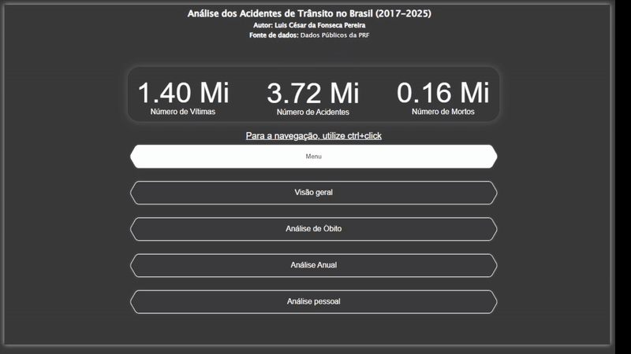

# Analysis of Road Accidents in Brazil (2017-2025)

### 🎬 Dashboard in Action

*
A brief demonstration of the dashboard's interactivity, filters, and visuals.
*

---

### Project Summary
This project presents a complete analysis of road accident data recorded by the Brazilian Federal Highway Police (PRF) between 2017 and 2025. The objective was to clean, model, and visualize the data to identify patterns, trends, and the main risk factors associated with fatal and non-fatal accidents on Brazilian highways. The data model was structured using a Star Schema due to its high query performance and more intuitive analysis.

### 🎥 Full Video Demonstration - 
**For a detailed analysis and presentation of the insights, please watch the full demonstration:**

**[▶️ Watch Presentation on YouTube (5 min)](https://youtu.be/gDsP4T9vNyE)**

### Questions Answered
The dashboard was built to answer critical questions, such as:
1.  What are the main types of vehicles, locations, and times of day for accidents?
2.  Which highways and accident causes present the highest fatality risk?
3.  What is the historical trend of accidents over the years, and what is the forecast for the future?
4.  What is the demographic profile (gender, age) of the victims and its relationship with the severity of the accident?

---

### Tools Used
* **Power BI:** For the entire ETL, data modeling, and visualization process.
* **Power Query (M Language):** For data cleansing, error handling, transformation, and consolidation.
* **DAX:** For creating complex measures and calculated columns (e.g., Fatality Rate).

---

### ETL and Modeling Process
The raw data, sourced from multiple annual files, underwent a rigorous ETL process in Power Query:
* **Consolidation:** CSV files from 2017 to 2025 were merged into a single database (`f_Accidents`).
* **Cleansing:** Handled null values, conversion errors, and implausible data (e.g., ages > 110).
* **Transformation:** Created custom columns to enrich the analysis, such as `Age Group`, `FullLocation`, and sorting columns.
* **Modeling:** The final model was structured using a **Star Schema**, with one fact table (`f_Accidents`) and three dimension tables (`d_Ocorrencia`, `d_Pessoas`, `d_Veiculos`), ensuring performance and clarity in the analyses.

#### Data Model (Star Schema)

---

### Main Dashboards and Insights

#### 1. Overview
* **Insight 1:** Weekends (Saturday and Sunday) concentrate the highest volume of accidents, most likely due to the increased number of people on the roads.
* **Insight 2:** More than half of the accidents (55%) occur during daytime, with a major focus on automobiles, and this pattern repeats across different years.

#### 2. Fatality Analysis
* **Insight 1:** "Incompatible Speed" and "Lack of Attention to Driving" are the leading causes of fatal accidents.
* **Insight 2:** The BR-116 and BR-101 highways stand out with the highest numbers of fatalities in the analyzed period.
* **Insight 3:** Geographic analysis of fatalities reveals a high concentration of incidents in the metropolitan regions of Curitiba, Belo Horizonte, and Recife.

#### 3. Yearly Analysis
* **Insight 1:** The number of accidents continues to rise year after year, and the forecast predicts a further increase.
* **Insight 2:** Both the absolute number of deaths and the fatality rate show an upward trend. This indicates that accidents are not only more frequent but also progressively more lethal.
* **Insight 3:** The key state appears to be Minas Gerais, which saw a surge in fatalities starting in 2020, peaking in 2024 with an increase of 1,119 deaths compared to 2023. This single-year increase alone surpasses the total number of deaths recorded in the state in 2017, highlighting the severity of the situation.

#### 4. Personal Analysis
* **Insight 1:** More than half (68%) of the individuals involved in traffic accidents are drivers, followed by passengers (29%).
* **Insight 2:** When correlating the cause of the accident with the profile of the person involved, it's clear that the main causes are attributed to the driver (e.g., lack of attention, speeding).
* **Insight 3:** The 20-40 age group represents the most critical demographic, accounting for over 1.4 million accidents. This group is followed by those aged 40-50, who account for 603,000 accidents.

---

### 📂 Power BI Source File (.pbix)
Due to the large file size (277MB), the Power BI source report is hosted on Google Drive.

**[Click here to download the .pbix file via Google Drive](https://drive.google.com/file/d/1h38cj5MR65cn3l1LxkEjdk-qriF3fFkL/view?usp=sharing)**

### Contact
**[Luis César da Fonseca Pereira]** - [LinkedIn](https://www.linkedin.com/in/luis-cesar-pereira/) 
